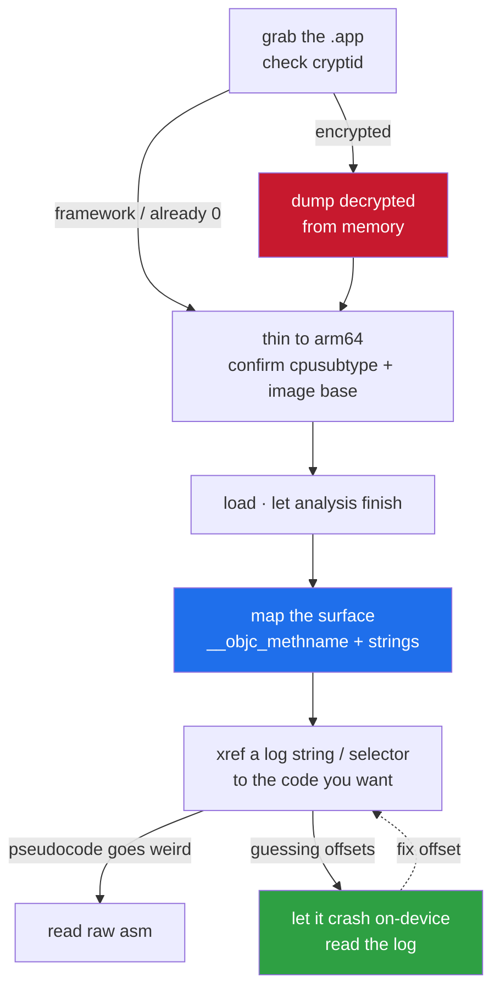
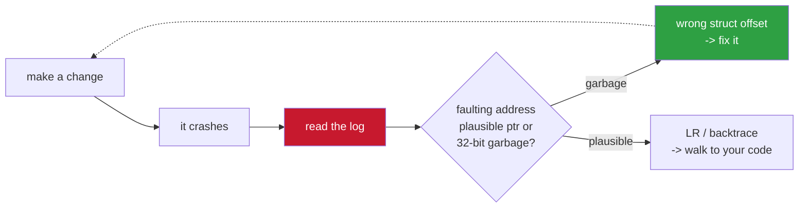

<h1 align="center">ios-binary-re-notes</h1>

<p align="center">the boring groundwork of reversing an iOS app binary — getting the decrypted binary, knowing what you're looking at, and not losing a week to the wrong slice</p>

<p align="center">
  
  
  
</p>

---

This is the boring groundwork nobody writes down: getting the decrypted binary,
understanding what you're looking at, and not wasting a week because you loaded the
wrong thing into IDA.

> Aimed at people who can read some ARM64 but haven't done much on Apple's platform.

---

## contents

- [the Mach-O you get is probably encrypted](#the-mach-o-you-get-is-probably-encrypted)
- [getting a decrypted dump](#getting-a-decrypted-dump)
- [fat binaries — pick the right slice](#fat-binaries--pick-the-right-slice)
- [loading it into a disassembler](#loading-it-into-a-disassembler)
- [objective-c is a gift](#objective-c-is-a-gift)
- [strings first, always](#strings-first-always)
- [reading crash logs to find offsets](#reading-crash-logs-to-find-offsets)
- [the ARM64 you need to know](#the-arm64-you-need-to-know)
- [quick workflow](#quick-workflow)

---

## the workflow, top to bottom



---

## the Mach-O you get is probably encrypted

App Store binaries ship with the main executable encrypted (**FairPlay**). If you
pull the `.app` off the device and open it, the `__TEXT` is garbage until it's
decrypted in memory. The `LC_ENCRYPTION_INFO_64` load command tells you:

| field | meaning |
|-------|---------|
| `cryptid` = 1 | still encrypted |
| `cryptid` = 0 | already decrypted (or never was, e.g. a framework) |
| `cryptoff` / `cryptsize` | the byte range that's encrypted |

Check it with:

```bash
otool -l Binary | grep -A4 crypt
```

> [!NOTE]
> If `cryptid` is 1 you can't do anything useful yet — decrypt first.

---

## getting a decrypted dump

You need the app running on a jailbroken device (or a good sim/emulator setup), then
dump it from memory after the loader has decrypted it. Options that work:

- a dump tool that hooks into the process and rewrites the encrypted range with what's
  now in memory, flipping `cryptid` to 0
- attach with a debugger, read the decrypted pages, patch the header yourself

The output is a "decrypted" Mach-O you can load statically.

> [!TIP]
> Frameworks and dylibs inside the app (`.framework`, embedded `.dylib`) are usually
> **not encrypted** — you can often reverse those directly. Sometimes the logic you
> want lives in an unencrypted framework, not the encrypted main binary.

---

## fat binaries — pick the right slice

Apple ships fat (universal) binaries with multiple architectures. On a modern device
you want the arm64 (or arm64e) slice, not armv7.

```bash
otool -f -h Binary        # or: lipo -info / lipo -thin arm64
```

> [!WARNING]
> Loading the wrong slice, or letting your tool auto-pick, is a classic time-sink —
> everything looks almost right but **every address is off**.

Also check `cpusubtype`:

| slice | `cpusubtype` | meaning |
|-------|--------------|---------|
| `arm64` | `ALL` (0) | plain, no pointer authentication |
| `arm64e` | 2 | **PAC on** — function/vtable pointers are signed |

This changes how you hook and how you read vtables later, so note it early.

---

## loading it into a disassembler

IDA, Ghidra, Binary Ninja, whatever you have. Two things people get wrong:

**1. Image base.** iOS binaries commonly link at `0x100000000`. Your tool should pick
this up from the Mach-O, but if you ever rebase or the base looks weird, every address
you derive afterward is silently wrong.

> [!IMPORTANT]
> I've lost hours to "my offsets are garbage" that was just a wrong base. **Confirm it
> before you trust anything.**

**2. Let auto-analysis finish, or know that it didn't.** On a big app (100 MB+
`__text`) analysis can take a long time or stall — xrefs, function boundaries and
vtables may be incomplete. If a decompilation comes out as nonsense `__swiftcall` with
garbage args, that's usually incomplete analysis, not the real code; drop to raw
disassembly for those spots.

---

## objective-c is a gift

Most of the app's own logic in an Objective-C app is trivially readable, because ObjC
keeps class and method names in the binary. Look at:

| section | holds |
|---------|-------|
| `__objc_classname` | class names |
| `__objc_methname` | selector names |
| `__objc_const` | class/method metadata (which method maps to which function) |

So even in a stripped binary you get `-[SomeClass doTheThing:]` for free. Message
sends go through `objc_msgSend`, so to see who calls what, look at the selectors
loaded right before each `objc_msgSend` / `_objc_msgSend$selector` stub.

> This is the single biggest reason iOS RE is friendlier than you'd expect. Swift is
> worse — names get mangled and a lot is generic — but the ObjC-interop surface is
> still readable.

---

## strings first, always

`strings -a Binary`, or the strings view in your tool. Cheap, and it points you at
everything: format strings for logging (`"init_info->size_:%d"` tells you struct
layout), error messages that name the check that failed, endpoint URLs, plist keys.

> Half of RE is finding the one log string next to the code you care about and
> xref-ing back to it.

If strings look encrypted (random-looking, XOR'd tables), the app has string
obfuscation — find the decrypt routine, understand its scheme, and script the decode.
The tell is: obvious ASCII for system stuff, garbage for the app's own secrets.

---

## reading crash logs to find offsets

You don't always need the disassembler first. A crash log from the device is gold:



- the faulting address, and whether it's a plausible pointer or 32-bit garbage
  (garbage usually means you read at the wrong struct offset)
- `LR` / the backtrace tells you the caller, so you can walk back to your own code
- symbolicate against the same binary you're reversing and the addresses line up with
  what's in IDA

I use this constantly: make a change, it crashes, the log says exactly which read was
wrong, fix the offset. Faster than staring at pseudocode.

---

## the ARM64 you need to know

| fact | detail |
|------|--------|
| **args / return** | args in `X0..X7`, return in `X0`, floats in `V0..V7` |
| **`this`** | `X0` for a method — `LDR X8,[X0]` loads the vtable |
| **virtual call** | `LDR X8,[X8,#off]; BLR X8` = virtual call at `off/8` |
| **bad offset tell** | a 32-bit-looking value where you expected a pointer; real iOS pointers are up around `0x1xxxxxxxx` |
| **ObjC** | `id`/`SEL` are just pointers in registers; the selector for a `msgSend` is in `X1` |

---

## quick workflow

Grab the app, check `cryptid`, dump decrypted if needed. Thin to arm64, confirm
cpusubtype and image base. Load it, let analysis run. Skim `__objc_methname` and
`strings` to map the surface. Xref from a log string or a selector to the code you
want. When pseudocode goes weird, read asm. When you're guessing offsets, let it crash
on-device and read the log.

That's it — the rest is game/app-specific.

---

<p align="center">
  <sub><b>part 1 of 7</b> in the <a href="https://github.com/shiedless/ios-ue4-re">ios-ue4-re</a> series</sub><br>
  <sub><a href="https://github.com/shiedless/ios-ue4-re">index</a> · <a href="https://github.com/shiedless/xor-string-deobf-notes">xor-string-deobf-notes</a> →</sub>
</p>

---

<p align="center">— shiedless</p>
